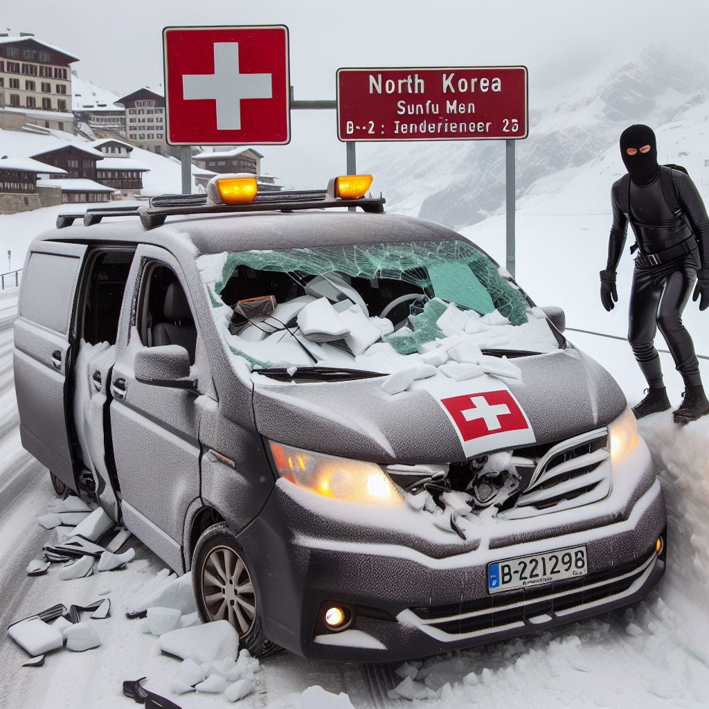
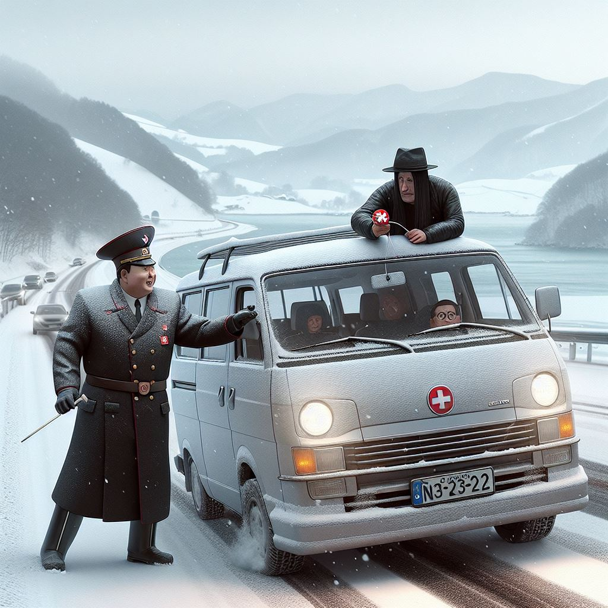
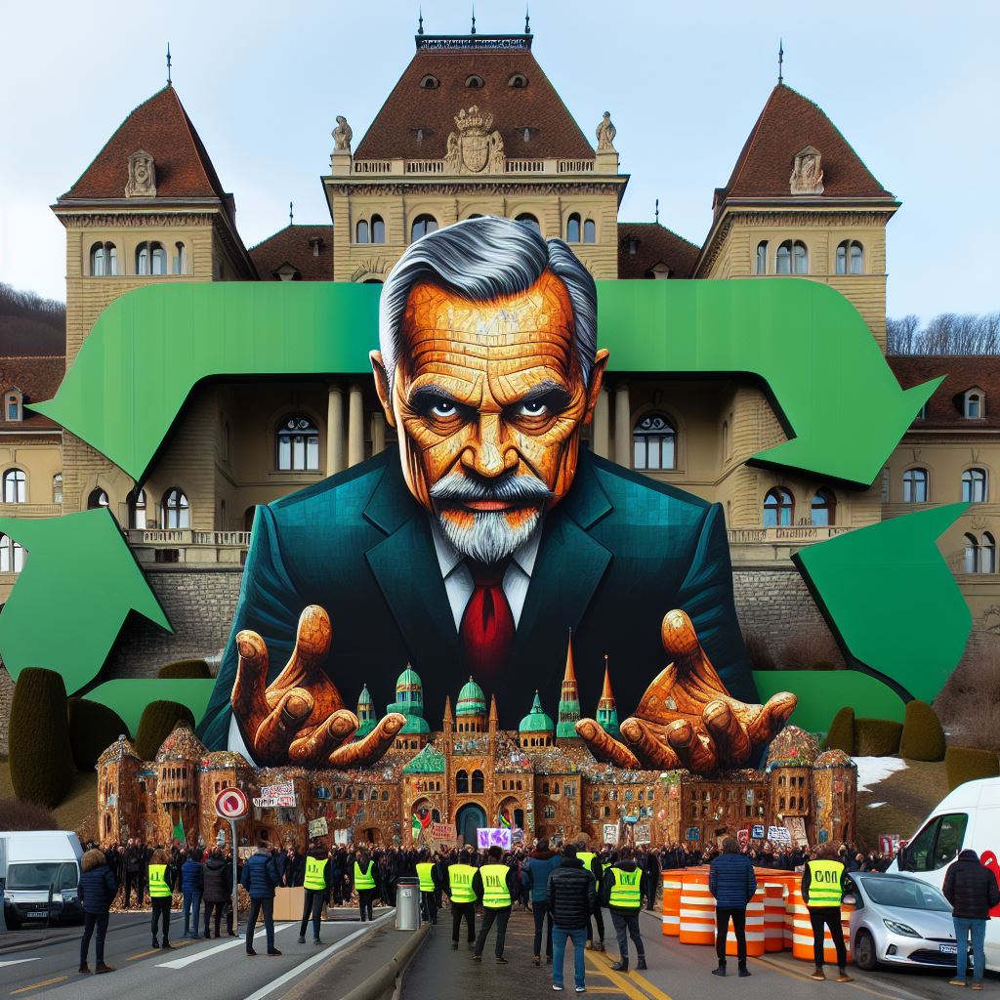
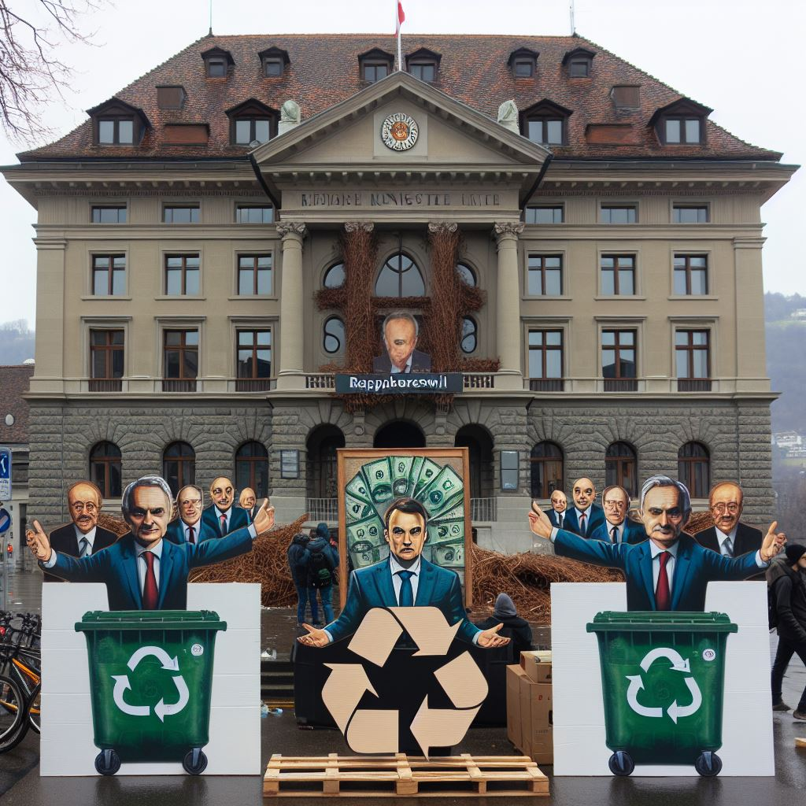
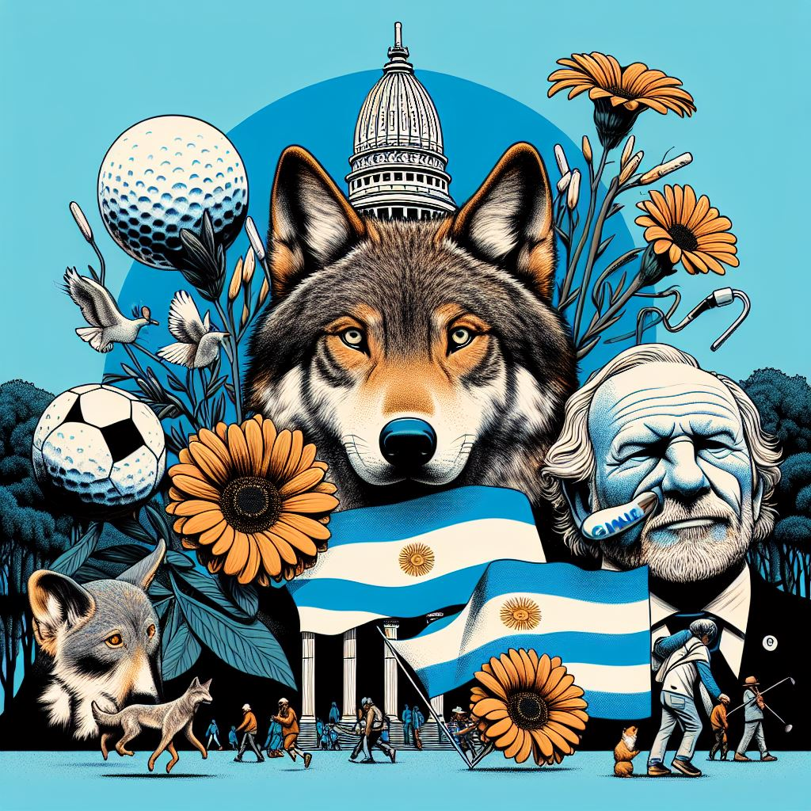
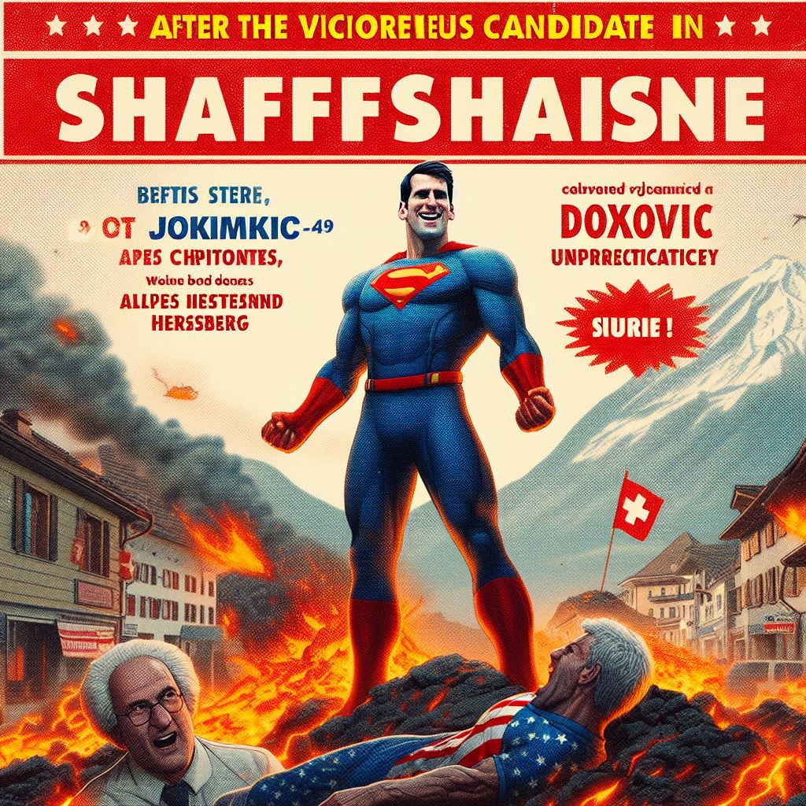

# DIGCRE23 - Digital Creativity - Winter 2023
 
 Ich folgendem Repository präsentiere ich mein Projekt für das Modul Digital Creativity im Wintersemester 2023.Das Ziel war es, im Feld von Künstlicher Intellegenz ein Projekt zu entwickeln, welches einen kreativen Aspekt beinhaltet.  

 Meine Idee war es, über einige Tage die Inhalte von zwei News-Websites zu analysieren. Alle Artikel der Website sollen pro Tag zusammengeführt werden und von diesem grossen Text sollen 10 Keywords extrahiert werden. Das Ergebnis sollten somit 10 Wörter pro Tag und pro Website sein. Mittels diesen Wörtern werden dann Bilder mittels generative ai Bilder generiert. Die Bilder sollen die Stimmung oder wichtige Ergeignisse des Tages wiederspiegeln.  

## 1. Web scraping
 Für das Experiment wurden die Websites von [srf.ch](https://www.srf.ch/) und [blick.ch](https://www.blick.ch/) verwendet. Um die aktuellen Artikel abzurufen wurde der RSS-Feed der beiden Websites verwendet. Vom RSS-Feed wurden die Links zu den Artikeln extrahiert und anschliessend die Inhalte der Artikel heruntergeladen. Hierfür wurden die Python Libraries BeautifulSoup, Feedparser und Requests verwendet. Mithilfe der Python Library BeautifulSoup, Feedparser und Requests wurden die Inhalte der Websites extrahiert.  
 
 ### Notebook [WebScraping_experiment](WebScraping_experiment.ipynb)
 Im Notebook [WebScraping_experiment](WebScraping_experiment.ipynb) ist der Code und Vorgang für das Web Scraping dokumentiert. Das Notebook soll helfen, den Vorgang nachzuvollziehen. Im Notebook werden die Inhalte der Websites extrahiert, strukturiert, in DataFrames abgelegt und anschliessend in CSV-Dateien gespeichert. Mithilfe des Notebooks wurde anschliessend ein Script erstellt, welches die Inhalte der Websites automatisch herunterlädt. 

 ### Script [main.py](main.py)
 Die Inhalte des Notebooks [WebScraping_experiment](WebScraping_experiment.ipynb) wurden in ein Script übertragen. Das Script lädt die Inhalte der Websites herunter und speichert diese in CSV-Dateien. Die Struktur des .CSV Files ist wie folgt:

  ```
    title, link, published, published_parsed, article_content
 ```

 Beispiel:

| title                                      | link                                           | published                    | published_parsed                  | article_content                                                                                      |
|--------------------------------------------|------------------------------------------------|------------------------------|-----------------------------------|------------------------------------------------------------------------------------------------------|
| Trägerin des Grand Prix Literatur: Autorin Ann... | https://www.blick.ch/news/traegerin-des-grand-... | Thu, 16 Nov 2023 13:54:05 GMT | (2023, 11, 16, 13, 54, 5, 3, 320, 0) | Beim Schreiben ist Anna Felder stets sehr bedä...

Das Ziel ist es, über mehrere Tage jeweils tageweise die Artikel zu speichern. Um konsistente Ergebnisse zu erhalten ist es wichtig, dass das Skript immer zur gleichen Zeit ausgeführt wird. Damit der Laptop nicht immer zur gleichen Zeit eingeschaltet werden muss, wurde das Skript auf einem Raspberry Pi hinterlegt. Der Raspberry Pi ist so konfiguriert, dass er mittels Cronjob das Skript täglich um 23:45 Uhr ausführt.


Mithilfe folgender Quellen wurde das Web Scraping realisiert:
- [How to install pip on the Raspberry Pi](https://pimylifeup.com/raspberry-pi-pip/)
- [Python Job Scheduling with Cron](https://www.advsyscon.com/blog/python-job-scheduling/)
- [Transfer files and folders from Windows to Linux with PSCP](https://opensource.com/article/22/10/transfer-files-windows-linux-pscp)

## 2. Keyword Extraction
Für das Keyword Extraction wurden verschiedene Ansätze versucht. Viele Natural Language Processing (NLP) Modelle sind auf Englisch trainiert und funktionieren nicht auf Deutsch. Da die Artikel in Deutsch sind, war der erste Ansatz, alle Artikel von Deutsch ins Englische zu übersetzen. Dieser Ansatz hat sich als nicht zielführend erwiesen. Die Menge an Daten wurde unterschätzt. Pro Website und pro Tag kamen bis zu 60 Artikel zusammen, wobei ein Artikel rund 3'000 Zeichen aufweist. Alle Artikel zusammengeführt ergab somit im Maximum 180'000 Zeichen für einen einzelnen Tag einer Website. Diese Länge war für die Untersuchten NLP Translationsmodelle zu lang. Die Modelle konnten die Texte nicht übersetzen. Zudem wäre dies auch sehr rechenintensiv gewesen.  

Nach weiterer Experimenten wurde ein neuer Ansatz gewählt. Es wurde von der Idee abgewichen, die Artikel-Texte zusammenzufügen. Offensichtlich ist der so erhaltene Textkorpus schlicht zu gross. Es wurde entschieden, dass lediglich die Titel der Artikel zusammengeführt werden. Die Titel sind kurz und enthalten die wichtigsten Informationen. Weiter sollten in den Titeln auch nicht viele Stoppwörter wie z.B. "der, die, ein, an, in" vor kommen, dies vereinfacht die Vorverarbeitung der Daten. Somit entstand pro Website und pro Tag ein Textkorpus von rund 3'000 Zeichen.  


### Notebook [keyBERT.ipynb](keyBERT.ipynb)
Nach weiterer Recherche wurde die Idee mit dme Übersetzen verworfen. Es wurde ein Modell gefunden, welches mit Deutschen Texten funktioniert. Herfür wurde [KeyBERT](https://maartengr.github.io/KeyBERT/) verwendet. Damit die deutschen Texte verarbeitet werden können, wurde als Sentence Transformers Modell [distiluse-base-multilingual-cased-v1](https://www.sbert.net/docs/pretrained_models.html) gewählt. Die Umsetzung ist im Notebook [keyBERT.ipynb](keyBERT.ipynb) dokumentiert.

## Experiment: Samstag, 18.11. bis Freitag, 24.11.2023
Für das Experiment wurden die Artikel der beiden Websites von Samstag, 18.11. bis Freitag, 24.11.2023 heruntergeladen. Die heruntergeladenen Artikel sind im Ordner data/articles/ abgelegt. Die extrahierten Keywords sind im .CSV File [articles_title_keywords_23_11_18-23.csv](/data/articles_title_keywords_23_11_18-23.csv) abgelegt. Eine erste Analyse der Keywords wurde mithilfe von [ydata-profiling](https://docs.profiling.ydata.ai/latest/) durchgeführt. Hiermit wurde ein HTML Report generiert.  

Das nachfolgende Bild zeigt die häufigsten Keywords der beiden Websites während der Woche vom 18.11. bis 24.11.2023.


## Bilder generieren
Mithilfe der Keywords wurden Bilder generiert. Hierfür wurde der Dienst von [Bing Image Creator AI](https://www.bing.com/images/create).

### 1. Versuch: Keywords mit einem bestimmten Stil
Es wurden die Keywords vom 21.11.2023 von der Website verwendet.  
Keywords: schnee, verkehrsunfall, minivan, nordkorea, erschossen, milliardenstrafe, black, bern, ausländer.  
Mit diesen Worten und dem Stil "Digial Cubism" wurde nachfolgendes Bild generiert:


Das Resultat ist nicht sehr zufriedenstellend. Die Bilder sind nicht sehr aussagekräftig. Es sind zwar Elemente der Keywords zu erkennen, wie zum Beispiel Schnee, Verkehrsunfall und die Stadt erinnert mit der markanten Kirche und den schneebedeckten Bergen im Hintergrund (Berner und Walliser Alpen) an Bern.

### 2. Versuch: ChatGPT Story
Nach weiterer Recherche wurde ein neuer Ansatz gewählt. Mit den Keywords soll eine Geschichte generiert werden. Hierfür wurden die Keywords genommen und mittels ChatGPT eine 1-Satz-Story auf englisch generiert werden. Die Story wurde anschliessend an Bing Image Creator AI übergeben.  
Dieselben Keywords wie im ersten Versuch (21.11.2023, Blick.ch): schnee, verkehrsunfall, minivan, nordkorea, erschossen, milliardenstrafe, black, bern, ausländer.  
Durch ChatGPT erzeugte Story: A Swiss minivan driver from Bern, traveling in the snow, got into a traffic accident and had to pay a hefty fine after accidentally crossing into North Korea and colliding with a foreigner dressed in black.


Folgende Bilder wurden mit Bing Image Creator AI generiert:

|  |  |  |
|--------------------------------------------------|--------------------------------------------------|--------------------------------------------------|

Die Resultate mit diesem Ansatz waren meiner Meinung nach besser. Die Bilder sind aussagekräftiger und enthalten diverse Elemente der Keywords.  

Das Experiment wurde mit den Keywords desselben Tages (21.11.2023) mit der Website von SRF durchgeführt.  
Keywords: recycling, rapperswil, bundeshaus, orban, positioniert, demoverbot, schweizer, schweiz, finanzministerium, bundeshaushalt  
ChatGPT Story: In Rapperswil, Switzerland, the Finance Ministry takes a stance against a protest ban outside the Federal Palace and emphasizes the importance of recycling in the federal budget, despite Orban's position.  

|  |  |  |
|--------------------------------------------------|--------------------------------------------------|------------------------------------------------|

Auch hier sind einige Keywors in den Bildern zu erkennen, wie z.B. Bundeshaus, Demoverbot, Recycling, Schweiz.


### Weiterer Versuch, gleicher Tag blick.ch und srf.ch: 19.11.2023
Keywords vom 19.11.2023, Blick.ch: blumen, mobilisierung, crash, golfbälle, wolfsjagd, tiefe, argentinier, israelische, ständeratswahlen, bundesratskandidaten  
Story: In a deep mobilization ahead of the Senate elections, flowers and golf balls were used in protest against the Israeli wolf hunt, while an Argentine criticizes federal council candidates  

|  |  |  |
|--------------------------------------------------|--------------------------------------------------|--------------------------------------------------|


Keywords vom 19.11.2023, srf.ch: wahlsiegerin, kandidat, linke, linkem, schweizer, schaffhausen, antisemitismus, djokovic, vulkangefahr, hersberg  
Story: After becoming the victorious candidate in Schaffhausen, a Swiss left-wing politician faces controversy over alleged anti-Semitism, while simultaneously warning of potential volcanic threats akin to Djokovic's unpredictability in Hersberg.

|  |  |  |
|--------------------------------------------------|--------------------------------------------------|--------------------------------------------------|


### Weiterer Versuch, gleicher Tag blick.ch und srf.ch: 18.11.2023
Keywords vom 19.11.2023, Blick.ch: schweiz, gefahr, unfall, feuer, ukrainischen, russische, schockierende, verschreckte, jordan, jugendliche  
Story: In Switzerland, residents witnessed an unexpected incident where Ukrainian and Russian youths had a surprising encounter, causing concern and excitement, especially for Jordan.

|  |  |  |
|--------------------------------------------------|--------------------------------------------------|--------------------------------------------------|

Keywords vom 19.11.2023, srf.ch: politik, wofür, thailand, energieversorger, wiederwahl, bern, sprintrennen, niederlande, vermieter, schweiz
Story: In politics, a Thai energy provider's bid for re-election in Bern mirrors the unpredictability of sprint races in the Netherlands, while Swiss landlords grapple with new regulations at home.

|  |  |
|--------------------------------------------------|--------------------------------------------------|

### Fazit Website Vergleich
Die Bilder von den zwei Websites unterscheiden sich stark. Aufgrund anderer Keywords ergaben sich völlig andere Bilder. Es war spannend, die Bilder zu vergleichen. Ganz aussagekräftig ist es jedoch nicht, da das Keyword Extraction Modell nicht perfekt umgesetzt wurde.


## Schlusswort
Das Projekt gab sehr viele spannende Erkenntnisse. Mit dem Web scraping und Raspberry Pi habe ich das erste Mal gearbeitet. Somit konnte ich sehr viel neues lernen. Vor allem auch gute Methoden und Erfahrungen für zukünftige Projekte sammeln. Mit dem Ressourcenschonenden Raspberry Pi gibt es noch viele gute Einsatzbereiche. Es war vor allem auch spannend, die eigene Kreavitität und Ideen ohne grosse Einschränkungen umzusetzen.


